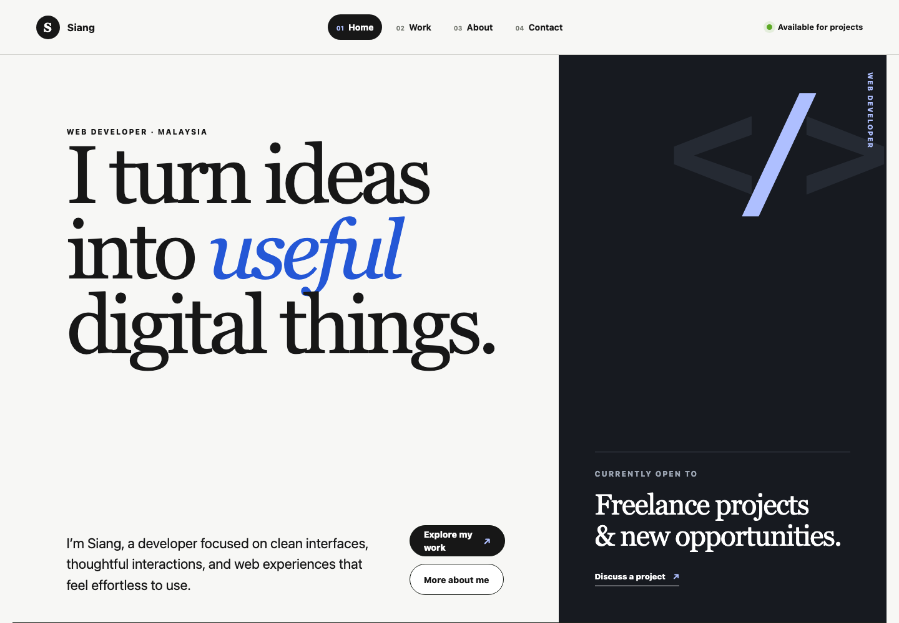

# Siang Portfolio

A responsive SvelteKit portfolio for Siang. It is designed to present his front-end work clearly to potential clients and employers across four connected pages: Home, Work, About, and Contact.

## Preview



## Refurbished layout

The original portfolio was refurbished with a minimalist editorial direction that feels professional, simple, and memorable without distracting from the work.

- Clear typography and stronger content hierarchy
- Focused calls to action for viewing projects and making contact
- Curated front-end project cards with live and source links
- An About page with education, capabilities, résumé, and certificate links
- Responsive layouts for desktop, tablet, and mobile screens
- Accessible semantic structure and reduced-motion support

The `main` branch contains the publish-ready website. Future layout experiments can continue on `feature/siang-portfolio-prototype` before being reviewed and merged into `main`.

## Stack

- SvelteKit and Vite
- Tailwind CSS 3 with documented custom component styles
- Responsive, accessible semantic HTML

## Run locally

```bash
npm install
npm run dev
```

## Quality checks

```bash
npm run lint
npm run build
```

Project information is maintained centrally in `src/lib/projects.js`. Global design primitives and responsive component styles live in `src/app.css`. The contact form is intentionally a local prototype interaction and does not transmit data.
